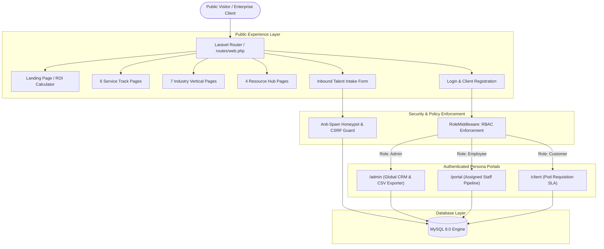

# NileBridge Global Services — Project Overview & System Blueprint

> **Enterprise B2B Global Talent, BPO & Operational Outsourcing Platform**  
> An end-to-end institutional monolith connecting North American, European, and global enterprises with high-caliber talent pods, customer support operations, and back-office infrastructure delivered from East Africa.

---

> **Documentation Navigation:**  
> 📖 **[Developer Guide & Local Setup (README.md)](README.md)** &nbsp;|&nbsp; 
> 🎯 **[Project Overview & Blueprint (PROJECT_OVERVIEW.md)](PROJECT_OVERVIEW.md)** *(Current)* &nbsp;|&nbsp; 
> 🏗️ **[System Architecture & Design (SYSTEM_DESIGN.md)](SYSTEM_DESIGN.md)** &nbsp;|&nbsp; 
> 🚀 **[Production Deployment Manual (DEPLOYMENT_GUIDE.md)](DEPLOYMENT_GUIDE.md)**

---

## 🎯 1. Why Was This Project Built?

### The Enterprise Problem
1. **Bloated Domestic Payroll:**  
   Enterprises in the United States, United Kingdom, and Western Europe spend between \$50,000 and \$85,000+ annually per employee on entry-to-mid level customer support, back-office, and technical operations. For high-growth SaaS, FinTech, and eCommerce companies, these domestic payroll burdens constrain innovation and scale.
2. **Global Hiring & EOR Friction:**  
   Hiring internationally typically involves complex legal hurdles, local corporate registrations, multi-currency payroll compliance, and cross-border labor regulations.
3. **Quality & SLA Degradation:**  
   Standard gig marketplaces and unmanaged offshore providers lack institutional Service Level Agreements (SLAs), enterprise data protection standards (SOC 2, ISO 27001), and robust business continuity safeguards.

### The NileBridge Solution
NileBridge Global Services was architected as a turnkey institutional outsourcing platform:
* **Up to 70% Cost Reduction:** Delivering university-educated, native English-fluent talent pools from our flagship Kampala Delivery Center in East Africa at a fraction of domestic costs.
* **Zero Compliance Friction (Turnkey Employer of Record):** NileBridge handles local employment contracts, statutory benefits, payroll taxes, healthcare, and operational governance.
* **Enterprise Infrastructure & Continuous Availability:** Built on enterprise-grade hardware, redundant fiber-optic internet, secondary power generation, and follow-the-sun 24/7/365 shift scheduling.

---

## 🌟 2. Key Features & Platform Capabilities

### A. Public Client Acquisition & Commercial Layer
* **High-Impact Enterprise Hero & Social Proof:** Institutional Navy & Teal aesthetic (`#060D1D`, `#0B152F`, `#0D9488`), live operational capacity telemetry, global client trust badges, and 1-click requisition handoff.
* **Reactive ROI & Cost Savings Calculator:**
  * **Real-time dynamic inputs:** Customer Support Reps (1–50 FTE headcount), Current Loaded Cost (\$/year), Monthly Ticket Volume, and NileBridge Hourly Rate (\$/hr).
  * **Instant financial outputs:** Calculated Annual Net Dollar Savings (\$), Savings Percentage (%), and Cost-Per-Ticket comparative efficiency metrics.
  * **Scalability Guarantee Banner:** Highlighting our 2-week risk-free trial and flexible scaling terms.
  * **1-Click Intake Transfer:** Automatically transfers calculated FTE scale and budget assumptions into the enterprise lead intake form.
* **6 Dedicated Service Track Deep-Dives:**
  1. 📞 **Customer Care & CX Operations** (`/services/call-center-customer-experience`)
  2. 💳 **FinTech & Payment Operations** (`/services/payment-operations`)
  3. 🗄️ **Back-Office & Data Processing** (`/services/back-office-operations`)
  4. 🛠️ **Technical Support Desk** (`/services/technical-support`)
  5. 🛒 **Digital & E-Commerce Operations** (`/services/digital-ecommerce-operations`)
  6. 🏥 **Healthcare Administration & Billing** (`/services/healthcare-administration`)
* **7 Dedicated Industry Vertical Solutions:**
  * E-Commerce & Retail, SaaS & Cloud Tech, FinTech & Payments, Healthcare & HealthTech, Higher Education, Financial Services, and Professional Services.
* **4 Institutional Resource Centers:**
  * 🧮 **Interactive Cost Calculator** (`/resources/calculator`) — Dedicated full-page financial modeling sandbox.
  * 📖 **Strategic BPO Playbook** (`/resources/bpo-guide`) — Comprehensive operational guide to East African outsourcing.
  * 📈 **Enterprise Growth & Metrics Case Studies** (`/resources/case-studies`) — Empirical quantitative outcomes across client pods.
  * 💡 **Industry Research & Market Insights** (`/resources/insights`) — Macroeconomic research on distributed global teams.
* **Interactive Transparent Pricing Models:**
  * Monthly / Annual (Save 20%) billing switcher with reactive live price updates across all tiers: Basic (\$299/mo), Growth (\$799/mo - Most Popular), Enterprise (\$1,999/mo), and Bespoke Custom SLAs.
* **Institutional Legal & Compliance Pages:**
  * 🔒 **Privacy Policy** (`/privacy-policy`) — GDPR, NDPA, and international data protection compliance documentation.
  * 📜 **Terms of Service** (`/terms-of-service`) — Enterprise Master Services Agreement (MSA) and SLA covenants.

---

### B. Enterprise Lead Ingestion & Anti-Spam Security
* **Honeypot Anti-Bot Shield:** Transparent trap input field rejecting automated spam submissions without disrupting genuine human visitors.
* **Strict Server-Side Validation:** Data sanitization, email normalization, integer range enforcement, and database transaction atomicity.
* **Automated Audit Logging:** Inbound inquiries automatically trigger timestamped initial audit memos logged into the CRM timeline.
* **Executive Flash Feedback:** Instant confirmation prompts delivering clear SLA follow-up timelines to prospective enterprise sponsors.

---

### C. 3 Isolated Multi-Role Portals (RBAC)

#### 1. 👑 Admin Oversight Portal (`/admin`)
* **Target Audience:** VP of Operations, Managing Directors, and Executive Leadership.
* **Core Capabilities:**
  * Real-time visibility over global pipeline volume, lead velocity, and unassigned inquiry queues.
  * High-density searchable and filterable leads table across status stages and service categories.
  * Account Executive workload dispatch and lead reassignment drawer with audit justification logging.
  * One-click CSV dataset export (`/admin/leads/export`) for external BI and ERP reporting.

#### 2. 💼 Employee / Account Executive Portal (`/portal`)
* **Target Audience:** Account Executives, Talent Matching Specialists, and Pod Operations Leads.
* **Core Capabilities:**
  * Strictly scoped to requisitions assigned to the authenticated staff member.
  * Linear CRM pipeline stage transitions (`New` ➔ `Contacted` ➔ `Qualified` ➔ `Proposal Sent` ➔ `Closed Won` / `Lost`).
  * Chronological follow-up timeline note logging with relative timestamps.
  * Quick stage filters with real-time record count badges.

#### 3. 🏢 Client / Enterprise Customer Portal (`/client`)
* **Target Audience:** Corporate Sponsors, CTOs, and Customer Success Directors (e.g., Acme Fintech Corp).
* **Core Capabilities:**
  * Live monitoring of active pod requisitions and talent scale.
  * Dedicated Account Executive contact dossier and direct escalation channels.
  * Tier-1 Institutional SLA status cards with risk-free replacement guarantees.
  * 4-phase onboarding lifecycle milestone tracking.

#### 4. 🔐 Client Self-Registration & Authentication Gateway (`/register` & `/login`)
* **Self-Service Client Onboarding (`/register`):** Seamless self-signup with full name, company name, corporate email, phone, and password confirmation.
* **Bcrypt Cryptographic Security:** 12-round salted hashing securing all credentials in the database.
* **1-Click Evaluation Credentials:** Instant evaluation buttons on the login screen for rapid executive walkthroughs.

---

## 🏗️ 3. High-Level System Architecture

---

## 📊 4. Operational Metrics & Business Impact

| Metric | Measured Target | Enterprise Significance |
| :--- | :---: | :--- |
| **Cost Reduction** | **Up to 70%** | Significant recurring annualized EBITDA savings compared to domestic hiring. |
| **Time to Deployment** | **< 14 Business Days** | Pre-vetted candidate dossiers and pods ready to deploy within two weeks. |
| **Replacement Guarantee** | **2-Week Risk-Free SLA** | Complimentary talent reassignment if performance does not meet SLAs. |
| **Automated Test Coverage** | **19 Tests / 119 Assertions** | 100% pass rate across public routing, intake validation, and RBAC isolation. |

---
 
## 🔗 Documentation Links & Cross-References
* 📖 **[Developer Guide & Local Setup (README.md)](README.md)** — Daily quickstart, environment installation, testing suite, and seeded accounts.
* 🏗️ **[System Architecture & Design Document (SYSTEM_DESIGN.md)](SYSTEM_DESIGN.md)** — In-depth ERD diagrams, database dictionary, and RBAC matrix.
* 🚀 **[Production Deployment Manual (DEPLOYMENT_GUIDE.md)](DEPLOYMENT_GUIDE.md)** — Production server setup, Nginx configuration, SSL, and automated deployment script.

---
*Authorized by the NileBridge Global Services Architecture & Engineering Committee.*
