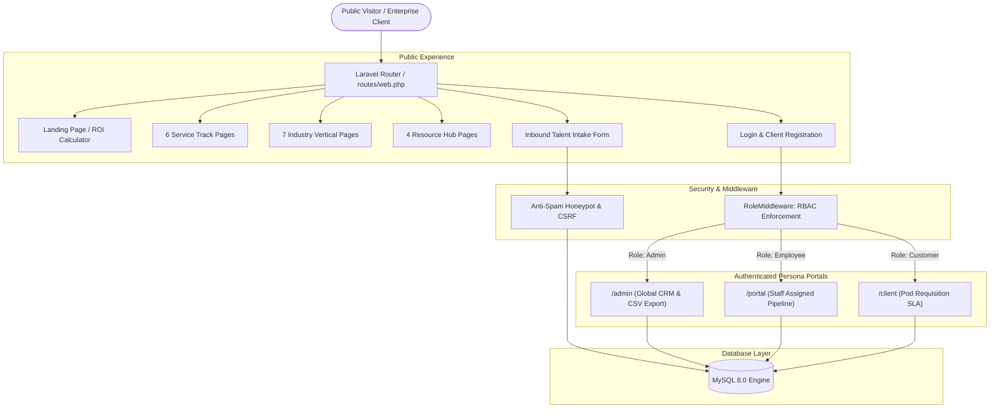

# NileBridge Global Services — Project Overview & System Blueprint

> **Enterprise B2B Global Talent, BPO & Operational Outsourcing Platform**  
> An end-to-end monolith connecting North American, European, and global enterprises with high-caliber talent pods, customer support operations, and back-office infrastructure delivered from East Africa.

---

## 🎯 1. Why Was This Project Built? (কেন এই প্রজেক্ট তৈরি করা হয়েছে?)

### The Enterprise Problem (বাস্তব সমস্যা)
1. **অতিরিক্ত খরচ ও বাজেট সংকট (Bloated Domestic Payroll):**  
   যুক্তরাষ্ট্র, যুক্তরাজ্য এবং ইউরোপীয় কোম্পানিগুলো তাদের অভ্যন্তরীণ কাস্টমার সাপোর্ট, ফিনটেক ব্যাক-অফিস ও টেকনিক্যাল টিমের পেছনে প্রতি কর্মীতে বাৎসরিক \$50,000 থেকে \$85,000 ডলারেরও বেশি ব্যয় করে। ছোট ও মাঝারি গ্রোথ কোম্পানিগুলোর জন্য এই খরচ বহন করা অত্যন্ত কঠিন।
2. **আন্তর্জাতিক নিয়োগ ও ট্যাক্স কমপ্লায়েন্স জটিলতা (Global Hiring & EOR Friction):**  
   অন্য দেশ থেকে কর্মী নিয়োগ করতে গেলে জটিল আন্তর্জাতিক শ্রম আইন, ট্যাক্সেশন, লোকাল বেনিফিটস এবং কারেন্সি কনভার্শনের মতো জটিলতার মুখোমুখি হতে হয়।
3. **টাইমজোন ও কোয়ালিটি নিয়ন্ত্রণ (Timezone & Quality SLA Assurance):**  
   সাধারণ ফ্রিল্যান্স মার্কেটপ্লেসগুলোতে কোনো প্রাতিষ্ঠানিক SLA (Service Level Agreement), সিকিউরিটি প্রটোকল বা কোয়ালিটি কন্ট্রোল থাকে না।

### The NileBridge Solution (সমাধান)
NileBridge Global Services তৈরি করা হয়েছে একটি প্রাতিষ্ঠানিক সমাধান হিসেবে:
* **৭০% পর্যন্ত খরচ হ্রাস (Up to 70% Cost Reduction):** উগান্ডার কাম্পালা হাব থেকে বিশ্বমানের ডিগ্রিধারী, ইংরেজিতে সাবলীল ট্যালেন্ট পুল সরবরাহ করে খরচ নাটকীয়ভাবে কমিয়ে আনা।
* **জিরো কমপ্লায়েন্স ঝুঁকি (Turnkey Employer of Record):** পেরোল, ট্যাক্স, চুক্তি ও আইনগত সকল দায়িত্ব NileBridge নিজে হ্যান্ডেল করে।
* **ইনস্টিটিউশনাল সিকিউরিটি ও অবকাঠামো:** SOC 2 Type-II ও ISO 27001 স্ট্যান্ডার্ড সিকিউরিটি, ২৪/৭ পাওয়ার ব্যাকআপ এবং ফলো-দ্য-সান (Follow-the-Sun) গ্লোবাল কভারেজ।

---

## 🌟 2. Key Features & Platform Capabilities (কী কী ফিচার আছে?)

### A. Public Client Acquisition & Commercial Layer (পাবলিক প্ল্যাটফর্ম)
* **High-Impact Enterprise Hero & Social Proof:** প্রাতিষ্ঠানিক ব্র্যান্ড আইডেন্টিটি (Deep Navy & Vibrant Teal), লাইভ ক্যাপাসিটি মেট্রিক্স, এন্টারপ্রাইজ ট্রাস্ট ব্যাজ এবং এক-ক্লিকে ট্যালেন্ট রিকুইজিশন ফর্ম।
* **Client-Configured ROI & Cost Savings Calculator:**
  * **রিয়েল-টাইম ডায়নামিক ইনপুট:** Customer Support Reps (টিম সাইজ), Current Loaded Cost (\$/বছর), Monthly Ticket Volume, এবং NileBridge Hourly Rate (\$/ঘণ্টা)।
  * **তাৎক্ষণিক আউটপুট:** বাৎসরিক মোট সাশ্রয় (Annual Savings), সেভিংস পার্সেন্টেজ (Savings %) এবং টিকিট প্রতি খরচের তুলনা (Cost Per Ticket Comparison)।
  * **Scalability Guarantee ব্যানার:** ২ সপ্তাহের রিস্ক-ফ্রি ট্রায়াল ও ফ্লেক্সিবল স্কেলিং গ্যারান্টি।
  * **১-ক্লিক হ্যান্ডঅফ:** ক্যালকুলেটরের ফলাফল স্বয়ংক্রিয়ভাবে পাবলিক ইনটেক ফর্মে ট্রান্সফার হয়ে যায়।
* **৬টি বিশেষায়িত সার্ভিস ট্র্যাক (Dedicated Service Track Pages):**
  1. 📞 **Customer Care & CX Operations** (`/services/call-center-customer-experience`)
  2. 💳 **FinTech & Payment Operations** (`/services/payment-operations`)
  3. 🗄️ **Back-Office & Data Processing** (`/services/back-office-operations`)
  4. 🛠️ **Technical Support Desk** (`/services/technical-support`)
  5. 🛒 **Digital & E-Commerce Operations** (`/services/digital-ecommerce-operations`)
  6. 🏥 **Healthcare Administration & Billing** (`/services/healthcare-administration`)
* **৭টি ইন্ডাস্ট্রি সলিউশন পেজ (Dedicated Industry Vertical Pages):**
  * E-Commerce & D2C, SaaS & Cloud Tech, FinTech & Payments, Healthcare & HealthTech, Higher Education, Financial Services, এবং Professional Services।
* **৪টি নলেজ ও রিসোর্স সেন্টার (Institutional Resource Hub):**
  * 🧮 **Interactive Cost Calculator** (`/resources/calculator`)
  * 📖 **Strategic BPO Playbook & Guide** (`/resources/bpo-guide`)
  * 📈 **Enterprise Growth & Metrics Case Studies** (`/resources/case-studies`)
  * 💡 **Industry Research & Market Insights** (`/resources/insights`)
* **ইন্টারঅ্যাক্টিভ প্রাইসিং সেকশন (Flexible Plans for Every Stage):**
  * Monthly / Annual (Save 20%) টগল সুইচ।
  * বাটন ও টেক্সট উভয়টিতে ক্লিক করলেই রিয়েল-টাইমে দাম ডিসকাউন্টে বদলে যায়।
  * ৪টি টায়ার: Basic (\$299/mo), Growth (\$799/mo - Most Popular), Enterprise (\$1,999/mo), এবং Bespoke Custom SLA।
* **ইনস্টিটিউশনাল লিগ্যাল পেজ (Legal & Compliance Suite):**
  * 🔒 **Privacy Policy** (`/privacy-policy`) — GDPR ও আন্তর্জাতিক ডেটা প্রটেকশন কমপ্লায়েন্স।
  * 📜 **Terms of Service** (`/terms-of-service`) — এন্টারপ্রাইজ মাস্টার সার্ভিসেস চুক্তি (MSA) ও SLA কাঠামো।

---

### B. Enterprise Lead Ingestion & Anti-Spam Security (লিড ক্যাপচার ইঞ্জিন)
* **Honeypot Anti-Bot Shield:** স্প্যামিং এবং ম্যালিশিয়াস বট আটকাতে হিডেন হানিপট ফিল্টার।
* **Server-Side Strict Validation:** ইনপুট ফিল্টারিং, স্যানিটাইজেশন এবং ডেটাবেজ ট্রানজেকশন সেফটি।
* **অটোমেটেড অডিট মেমো:** লিড সাবমিট হওয়ামাত্রই স্বয়ংক্রিয়ভাবে টাইমস্ট্যাম্প সহ ইন্টারনাল অডিট নোট জেনারেট হয়।
* **ইনস্ট্যান্ট নোটিফিকেশন ব্যানার:** লিড সাবমিশনের পর স্ক্রিনে এন্টারপ্রাইজ কনফার্মেশন প্রম্পট।

---

### C. 3 Isolated Multi-Role Portals (৩ স্তরের রোল-বেসড ড্যাশবোর্ড)

#### 1. 👑 Admin Oversight Portal (`/admin`)
* **টার্গেট ইউজার:** VP of Operations, অপারেশনাল ডিরেক্টর এবং এক্সিকিউটিভ টিম।
* **কী কী করতে পারে:**
  * পুরো প্ল্যাটফর্মের সকল লিড ও পাইপলাইন মেট্রিক্স তদারকি।
  * সার্চ, স্ট্যাটাস ও ক্যাটাগরি অনুযায়ী হাই-ডেনসিটি লিড ফিল্টারিং।
  * যেকোনো নির্দিষ্ট লিড যেকোনো সেলস এক্সিকিউটিভকে (Account Executive) অ্যাসাইন বা রি-অ্যাসাইন করা।
  * এক ক্লিকে সম্পূর্ণ লিড ডেটা **CSV ফাইল** হিসেবে ডাউনলোড/এক্সপোর্ট করা (`/admin/leads/export`)।

#### 2. 💼 Employee / Account Executive Portal (`/portal`)
* **টার্গেট ইউজার:** ডেডিকেটেড সেলস টিম, একাউন্ট ম্যানেজার এবং ট্যালেন্ট স্পেশালিস্টরা।
* **কী কী করতে পারে:**
  * শুধুমাত্র নিজের কাছে অ্যাসাইন করা (Assigned To Me) ক্লায়েন্ট রিকুইজিশন দেখতে পায়।
  * পাইপলাইন স্টেজ ম্যানেজমেন্ট (`New` ➔ `Contacted` ➔ `Qualified` ➔ `Proposal Sent` ➔ `Closed Won` / `Lost`)।
  * প্রতিটি ক্লায়েন্ট কলের বিস্তারিত নোট লগ করা (CRM Timeline Notes)।
  * কুইক স্টেজ ফিল্টার ও সার্চ সুবিধা।

#### 3. 🏢 Client / Enterprise Customer Portal (`/client`)
* **টার্গেট ইউজার:** কর্পোরেট ক্লায়েন্টরা (যেমন: Acme Fintech Corp)।
* **কী কী করতে পারে:**
  * সাবমিট করা রিকুইজিশন ও ট্যালেন্ট পডের রিয়েল-টাইম স্ট্যাটাস দেখা।
  * ডেডিকেটেড একাউন্ট পার্টনার ও ট্যালেন্ট স্পেশালিস্টের সাথে যোগাযোগের তথ্য।
  * সার্ভিসের Tier-1 Institutional SLA গ্যারান্টি ওভারভিউ।
  * ৪-ধাপের অনবোর্ডিং লাইফসাইকেল ট্র্যাকিং।

#### 4. 🔐 Client Self-Registration & Authentication Gateway (`/register` & `/login`)
* **নতুন ক্লায়েন্ট সাইন আপ (`/register`):** নাম, কোম্পানির নাম, কাজের ইমেইল, ফোন এবং পাসওয়ার্ড কনফার্মেশন দিয়ে নতুন ক্লায়েন্ট অ্যাকাউন্ট তৈরি।
* **ক্রিপ্টোগ্রাফিক পাসওয়ার্ড সুরক্ষা:** Bcrypt (12 Rounds Salted Hash) দিয়ে ডাটাবেজে পাসওয়ার্ড সংরক্ষিত।
* **১-ক্লিক ডেমো লগইন:** ইভ্যালুয়েশনের সুবিধার্থে এডমিন, স্টাফ ও ক্লায়েন্ট রোলের জন্য ১-ক্লিক ডেমো ক্রেডেনশিয়াল ফিল বাটন।

---

## 🏗️ 3. High-Level Technical Architecture

---

## 📊 4. Business Metrics & Impact Summary

| মেট্রিক | অর্জিত মান | তাৎপর্য |
| :--- | :---: | :--- |
| **খরচ সাশ্রয় (Cost Reduction)** | **Up to 70%** | দেশীয় বেতনের তুলনায় প্রতিষ্ঠানগুলোর বাৎসরিক লাখ লাখ ডলার সাশ্রয়। |
| **অনবোর্ডিং স্পিড (Time to Deploy)** | **< 14 Days** | প্রচলিত ২–৩ মাসের রিক্রুটমেন্ট সাইকেলের বিপরীতে মাত্র ২ সপ্তাহে ডেডিকেটেড টিম লাইভ। |
| **রিপ্লেসমেন্ট গ্যারান্টি (SLA)** | **2-Week Risk-Free** | কোনো ট্যালেন্ট ম্যাচিং সন্তোষজনক না হলে ফ্রি রিপ্লেসমেন্ট। |
| **টেস্ট কভারেজ (Automated Tests)** | **19 Tests / 119 Assertions** | ফুল প্ল্যাটফর্ম রিগ্রেশন ও সিকিউরিটি টেস্ট ১০০% পাস। |

---
*ডকুমেন্টটি NileBridge Global Services আর্কিটেকচার কমিটির অনুমোদিত।*

