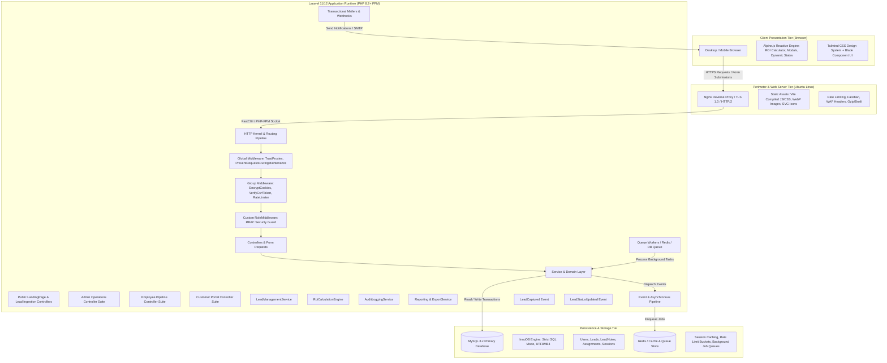
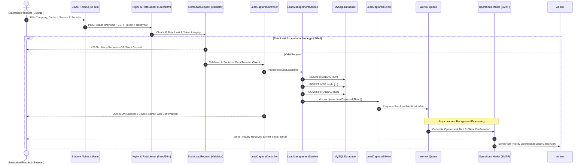
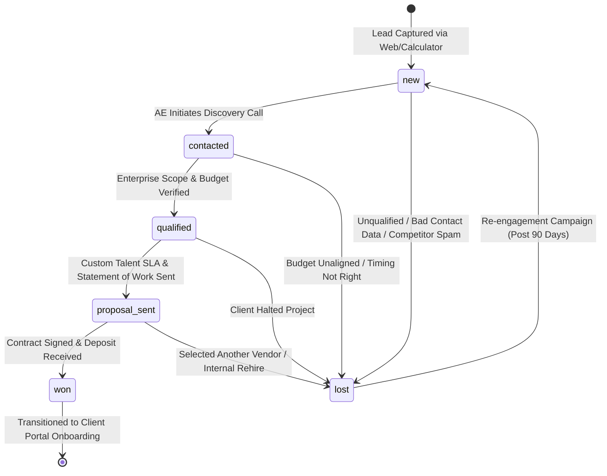

# NileBridge Global Services — System Architecture & Technical Design Document
**Document Version:** 1.0.0  
**Status:** Approved for Implementation  
**Target Environment:** Ubuntu 24.04 LTS | PHP 8.2+ | Laravel 11/12 | MySQL 8.0+ | Tailwind CSS | Alpine.js  
**Author:** Principal Software Architect  
**Last Updated:** September 2026  

---

> **Documentation Navigation:**  
> 📖 **[Developer Guide & Local Setup (README.md)](README.md)** &nbsp;|&nbsp; 
> 🎯 **[Project Overview & Blueprint (PROJECT_OVERVIEW.md)](PROJECT_OVERVIEW.md)** &nbsp;|&nbsp; 
> 🏗️ **[System Architecture & Design (SYSTEM_DESIGN.md)](SYSTEM_DESIGN.md)** *(Current)* &nbsp;|&nbsp; 
> 🚀 **[Production Deployment Manual (DEPLOYMENT_GUIDE.md)](DEPLOYMENT_GUIDE.md)**

---

## Table of Contents
1. [Executive Summary & Project Objectives](#1-executive-summary--project-objectives)
2. [High-Level Architecture Overview](#2-high-level-architecture-overview)
   - 2.1 [Architecture Diagram](#21-architecture-diagram)
   - 2.2 [Component Responsibilities](#22-component-responsibilities)
3. [Database Architecture & Schema Specification](#3-database-architecture--schema-specification)
   - 3.1 [Entity-Relationship Diagram (ERD)](#31-entity-relationship-diagram-erd)
   - 3.2 [Data Dictionary & Table Definitions](#32-data-dictionary--table-definitions)
   - 3.3 [Foreign Key Constraints & Cascade Policies](#33-foreign-key-constraints--cascade-policies)
   - 3.4 [Indexing & Query Optimization Strategy](#34-indexing--query-optimization-strategy)
4. [Application Routing & Role-Based Access Control (RBAC)](#4-application-routing--role-based-access-control-rbac)
   - 4.1 [RBAC Permissions Matrix](#41-rbac-permissions-matrix)
   - 4.2 [Route Hierarchy & URI Groupings](#42-route-hierarchy--uri-groupings)
   - 4.3 [Custom RoleMiddleware Implementation](#43-custom-rolemiddleware-implementation)
   - 4.4 [Authorization Policies & Gates](#44-authorization-policies--gates)
5. [Interactive Feature Logic & Data Flow](#5-interactive-feature-logic--data-flow)
   - 5.1 [Alpine.js Reactive ROI Calculator Engine](#51-alpinejs-reactive-roi-calculator-engine)
   - 5.2 [Lead Capture & Ingestion Lifecycle](#52-lead-capture--ingestion-lifecycle)
   - 5.3 [Lead Pipeline State Machine](#53-lead-pipeline-state-machine)
6. [Landing Page UI/UX Component Specifications](#6-landing-page-uiux-component-specifications)
   - 6.1 [Section Architectural Blueprints](#61-section-architectural-blueprints)
   - 6.2 [Traditional vs. NileBridge Comparison Matrix](#62-traditional-vs-nilebridge-comparison-matrix)
7. [Security, Performance & Scalability Engineering](#7-security-performance--scalability-engineering)
   - 7.1 [Defensive Security Posture](#71-defensive-security-posture)
   - 7.2 [Performance Benchmarks & Optimization](#72-performance-benchmarks--optimization)
   - 7.3 [Queue & Asynchronous Execution Architecture](#73-queue--asynchronous-execution-architecture)
8. [Directory Structure & File Organization](#8-directory-structure--file-organization)
9. [Deployment, Infrastructure & Maintenance](#9-deployment-infrastructure--maintenance)

---

## 1. Executive Summary & Project Objectives

### 1.1 Mission & Value Proposition
**NileBridge Global Services** is an enterprise-grade platform dedicated to connecting North American, European, and Gulf tier-1 companies with elite global talent, Business Process Outsourcing (BPO), and managed operational engineering. The platform delivers high-touch offshore/nearshore human capital integration, reducing operational expenditures by up to 70% while maintaining Western-standard compliance, KPIs, and cultural synergy.

### 1.2 Core Business & Technical Objectives
1. **High-Conversion Enterprise B2B Acquisition:** Deliver an authoritative, high-performance web presence with sub-second page loads (<800ms Largest Contentful Paint), clear institutional trust signals, and interactive client utility.
2. **Interactive Prospect Value Quantification:** Provide an instantaneous, zero-latency client-side ROI calculator powered by Alpine.js that illustrates annual savings across various workforce disciplines and dynamically primes the lead conversion pipeline.
3. **Streamlined Pipeline & Role-Based Workflows:** Implement a secure, deterministic Role-Based Access Control (RBAC) engine partitioned into three dedicated personas:
   - **Administrators:** Global management, lead assignment, business analytics, user management, and compliance export.
   - **Employees (Account Executives / Operations):** Daily lead progression, qualification, discovery notes, proposal tracking, and pipeline velocity.
   - **Customers (Enterprise Clients):** Self-service visibility into onboarding inquiries, talent requisitions, and proposal milestones.
4. **Architectural Resilience & Scalability:** Build on Laravel 11/12 and MySQL 8.x with clean separation of concerns, robust transaction handling, event-driven background processing, and hardened perimeter defense.

---

## 2. High-Level Architecture Overview

The system adopts a modern **Server-Side Rendered (SSR) + Reactive Islands** architecture. Laravel Blade supplies semantic, SEO-optimized markup rendered on Ubuntu/Nginx, while Tailwind CSS provides a clean design token system and Alpine.js delivers micro-reactive capabilities without the bloat and complexity of heavy client-side SPAs.

### 2.1 Architecture Diagram



### 2.2 Component Responsibilities

| Architectural Layer | Core Technology | Primary Responsibilities |
| :--- | :--- | :--- |
| **Presentation Tier** | Blade, Tailwind CSS, Alpine.js | Render responsive landing views, handle reactive calculation logic, capture prospective client inputs, manage client portal viewports. |
| **Edge / Web Server** | Ubuntu 24.04, Nginx | SSL/TLS termination, HTTP/2 multiplexing, static asset caching (CSS/JS/media), gzip/brotli compression, rate limiting perimeter. |
| **HTTP Routing & RBAC** | Laravel 11/12 Routing Engine | Route dispatching, CSRF validation, session resolution, role-based boundary enforcement via `RoleMiddleware`. |
| **Validation Layer** | Form Requests (`StoreLeadRequest`, etc.) | Strict payload validation, sanitization, honeypot spam suppression, parameter casting. |
| **Application Services** | Pure PHP 8.2+ Service Classes | Business rule orchestration, transactional database transitions, calculation algorithms, audit logging. |
| **Queue / Asynchronous** | Laravel Queue (Database or Redis) | Decouple email dispatching, webhook notifications, and intensive CSV/Excel generation from synchronous HTTP request cycles. |
| **Data Persistence** | MySQL 8.x (InnoDB) | ACID-compliant relational storage, foreign key referential integrity, indexed search pipelines, soft deletion. |

---

## 3. Database Architecture & Schema Specification

### 3.1 Entity-Relationship Diagram (ERD)

```mermaid
erDiagram
    USERS ||--o{ LEADS : "assigned_to (as Employee)"
    USERS ||--o{ LEAD_NOTES : "authors (Admin or Employee)"
    USERS ||--o{ LEAD_ASSIGNMENTS : "assigned_by (Admin)"
    USERS ||--o{ LEAD_ASSIGNMENTS : "assigned_to (Employee)"
    USERS ||--o{ LEADS : "created_by / linked (as Customer)"
    
    LEADS ||--o{ LEAD_NOTES : "has many follow-up notes"
    LEADS ||--o{ LEAD_ASSIGNMENTS : "tracks assignment history"

    USERS {
        bigint unsigned id PK
        string name
        string email UK
        string password
        enum role "admin, employee, customer"
        string phone
        enum status "active, suspended, inactive"
        timestamp email_verified_at
        string remember_token
        timestamp created_at
        timestamp updated_at
    }

    LEADS {
        bigint unsigned id PK
        uuid uuid UK
        bigint unsigned customer_user_id FK "nullable: linked customer user"
        string company_name
        string contact_name
        string contact_email
        string contact_phone
        enum service_category "software_engineering, bpo_customer_support, finance_backoffice, digital_marketing"
        int team_size_needed
        decimal estimated_budget "12,2"
        json calculator_inputs "nullable: saved Alpine.js ROI state"
        enum status "new, contacted, qualified, proposal_sent, won, lost"
        bigint unsigned assigned_to FK "nullable: users.id (employee)"
        string source "landing_page, calculator, referral"
        string ip_address "45 chars"
        text user_agent
        timestamp created_at
        timestamp updated_at
        timestamp deleted_at "soft deletes"
    }

    LEAD_NOTES {
        bigint unsigned id PK
        bigint unsigned lead_id FK
        bigint unsigned user_id FK "author"
        text note
        enum stage_snapshot "new, contacted, qualified, proposal_sent, won, lost"
        timestamp created_at
        timestamp updated_at
    }

    LEAD_ASSIGNMENTS {
        bigint unsigned id PK
        bigint unsigned lead_id FK
        bigint unsigned assigned_by_user_id FK
        bigint unsigned assigned_to_user_id FK
        text assignment_reason
        timestamp assigned_at
        timestamp created_at
        timestamp updated_at
    }

    SESSIONS {
        string id PK
        bigint unsigned user_id FK "nullable"
        string ip_address "45 chars"
        text user_agent
        longtext payload
        int last_activity
    }

    JOBS {
        bigint unsigned id PK
        string queue
        longtext payload
        tinyint unsigned attempts
        int unsigned reserved_at
        int unsigned available_at
        int unsigned created_at
    }
```

---

### 3.2 Data Dictionary & Table Definitions

#### 3.2.1 Table: `users`
Represents all system actors partitioned into the three system roles: `admin`, `employee`, and `customer`.

| Column | Data Type | Nullable | Default | Key / Index | Description |
| :--- | :--- | :--- | :--- | :--- | :--- |
| `id` | `BIGINT UNSIGNED` | No | Auto-inc | `PRIMARY KEY` | Unique surrogate identifier. |
| `name` | `VARCHAR(191)` | No | None | None | Full legal or corporate representative name. |
| `email` | `VARCHAR(191)` | No | None | `UNIQUE (email)` | Unique RFC-compliant authentication email. |
| `password` | `VARCHAR(255)` | No | None | None | Argon2id or Bcrypt hashed password. |
| `role` | `ENUM('admin','employee','customer')` | No | `'customer'` | `INDEX (role)` | RBAC security persona discriminator. |
| `phone` | `VARCHAR(32)` | Yes | `NULL` | None | International E.164 phone string. |
| `status` | `ENUM('active','suspended','inactive')`| No | `'active'` | `INDEX (status)` | Account activation lifecycle status. |
| `email_verified_at` | `TIMESTAMP` | Yes | `NULL` | None | Timestamp of verified email token. |
| `remember_token` | `VARCHAR(100)` | Yes | `NULL` | None | Laravel persistent session cookie token. |
| `created_at` | `TIMESTAMP` | Yes | `NULL` | None | Record creation audit timestamp. |
| `updated_at` | `TIMESTAMP` | Yes | `NULL` | None | Record modification audit timestamp. |

#### 3.2.2 Table: `leads`
Captures prospective enterprise clients from the landing page, interactive ROI tool, or inbound sales channels.

| Column | Data Type | Nullable | Default | Key / Index | Description |
| :--- | :--- | :--- | :--- | :--- | :--- |
| `id` | `BIGINT UNSIGNED` | No | Auto-inc | `PRIMARY KEY` | Surrogate database identity. |
| `uuid` | `CHAR(36)` | No | None | `UNIQUE (uuid)` | External public/API identifier. |
| `customer_user_id` | `BIGINT UNSIGNED` | Yes | `NULL` | `FOREIGN KEY` | Linked customer user profile if registered. |
| `company_name` | `VARCHAR(191)` | No | None | `INDEX (company_name)`| Legal corporate entity name. |
| `contact_name` | `VARCHAR(191)` | No | None | None | Primary decision maker / procurement lead. |
| `contact_email` | `VARCHAR(191)` | No | None | `INDEX (contact_email)`| Inbound communication email. |
| `contact_phone` | `VARCHAR(32)` | Yes | `NULL` | None | Contact phone number. |
| `service_category` | `ENUM(...)` | No | None | `INDEX (service_cat)` | Outlined in enum definition below. |
| `team_size_needed` | `INT UNSIGNED` | No | `1` | None | Number of FTE resources required. |
| `estimated_budget` | `DECIMAL(12,2)`| Yes | `NULL` | None | Monthly or annual anticipated budget (USD). |
| `calculator_inputs` | `JSON` | Yes | `NULL` | None | Full snapshot of Alpine.js ROI parameters. |
| `status` | `ENUM(...)` | No | `'new'` | `INDEX (status)` | Pipeline progression state machine. |
| `assigned_to` | `BIGINT UNSIGNED` | Yes | `NULL` | `FOREIGN KEY` | Reference to `users.id` (Employee role). |
| `source` | `VARCHAR(64)` | No | `'landing_page'` | None | Lead origin (`landing_page`, `roi_calculator`, etc.). |
| `ip_address` | `VARCHAR(45)` | Yes | `NULL` | None | IPv4 or IPv6 client origin for audit/geo. |
| `user_agent` | `TEXT` | Yes | `NULL` | None | Client browser fingerprint header. |
| `created_at` | `TIMESTAMP` | Yes | `NULL` | `INDEX (created_at)`| Lead generation timestamp. |
| `updated_at` | `TIMESTAMP` | Yes | `NULL` | None | Last status or data mutation. |
| `deleted_at` | `TIMESTAMP` | Yes | `NULL` | None | Soft delete timestamp for audit recovery. |

*`service_category` Enum Values:*  
`'software_engineering'`, `'bpo_customer_support'`, `'finance_backoffice'`, `'digital_marketing'`

*`status` Enum Values:*  
`'new'`, `'contacted'`, `'qualified'`, `'proposal_sent'`, `'won'`, `'lost'`

#### 3.2.3 Table: `lead_notes`
Chronological activity and discovery notes created by Account Executives or Administrators during the sales cycle.

| Column | Data Type | Nullable | Default | Key / Index | Description |
| :--- | :--- | :--- | :--- | :--- | :--- |
| `id` | `BIGINT UNSIGNED` | No | Auto-inc | `PRIMARY KEY` | Note primary key. |
| `lead_id` | `BIGINT UNSIGNED` | No | None | `FOREIGN KEY` | Associated lead record. |
| `user_id` | `BIGINT UNSIGNED` | No | None | `FOREIGN KEY` | Note creator (Admin or Employee). |
| `note` | `TEXT` | No | None | None | Free-text discovery note, call log, or memo. |
| `stage_snapshot` | `VARCHAR(32)` | No | None | None | Snapshot of the lead status at note creation. |
| `created_at` | `TIMESTAMP` | Yes | `NULL` | `INDEX (created_at)`| Note logging timestamp. |
| `updated_at` | `TIMESTAMP` | Yes | `NULL` | None | Last note modification. |

#### 3.2.4 Table: `lead_assignments`
Immutable audit log recording lead allocation changes between employees.

| Column | Data Type | Nullable | Default | Key / Index | Description |
| :--- | :--- | :--- | :--- | :--- | :--- |
| `id` | `BIGINT UNSIGNED` | No | Auto-inc | `PRIMARY KEY` | Assignment record primary key. |
| `lead_id` | `BIGINT UNSIGNED` | No | None | `FOREIGN KEY` | Target lead. |
| `assigned_by_user_id`| `BIGINT UNSIGNED` | No | None | `FOREIGN KEY` | Administrator performing the action. |
| `assigned_to_user_id`| `BIGINT UNSIGNED` | No | None | `FOREIGN KEY` | Employee receiving the lead. |
| `assignment_reason` | `TEXT` | Yes | `NULL` | None | Operational rationale or instructions. |
| `assigned_at` | `TIMESTAMP` | No | `CURRENT_TIMESTAMP` | None | Audit timestamp. |
| `created_at` | `TIMESTAMP` | Yes | `NULL` | None | Standard Laravel timestamp. |
| `updated_at` | `TIMESTAMP` | Yes | `NULL` | None | Standard Laravel timestamp. |

---

### 3.3 Foreign Key Constraints & Cascade Policies

```sql
-- Leads references
ALTER TABLE leads
    ADD CONSTRAINT fk_leads_customer_user_id
    FOREIGN KEY (customer_user_id) REFERENCES users(id)
    ON DELETE SET NULL ON UPDATE CASCADE;

ALTER TABLE leads
    ADD CONSTRAINT fk_leads_assigned_to
    FOREIGN KEY (assigned_to) REFERENCES users(id)
    ON DELETE SET NULL ON UPDATE CASCADE;

-- Lead Notes references
ALTER TABLE lead_notes
    ADD CONSTRAINT fk_lead_notes_lead_id
    FOREIGN KEY (lead_id) REFERENCES leads(id)
    ON DELETE CASCADE ON UPDATE CASCADE;

ALTER TABLE lead_notes
    ADD CONSTRAINT fk_lead_notes_user_id
    FOREIGN KEY (user_id) REFERENCES users(id)
    ON DELETE RESTRICT ON UPDATE CASCADE;

-- Lead Assignments references
ALTER TABLE lead_assignments
    ADD CONSTRAINT fk_lead_assignments_lead_id
    FOREIGN KEY (lead_id) REFERENCES leads(id)
    ON DELETE CASCADE ON UPDATE CASCADE;

ALTER TABLE lead_assignments
    ADD CONSTRAINT fk_lead_assignments_assigned_by
    FOREIGN KEY (assigned_by_user_id) REFERENCES users(id)
    ON DELETE RESTRICT ON UPDATE CASCADE;

ALTER TABLE lead_assignments
    ADD CONSTRAINT fk_lead_assignments_assigned_to
    FOREIGN KEY (assigned_to_user_id) REFERENCES users(id)
    ON DELETE RESTRICT ON UPDATE CASCADE;
```

**Cascade Integrity Rationale:**
- Deleting a `lead` cascades to its `lead_notes` and `lead_assignments` (maintaining zero orphaned records while respecting soft-deletes in production).
- Deleting a `user` (staff member) is strictly `RESTRICT`ed if they have authored notes or assignments, preventing destructive loss of historic compliance records.
- Unassigning or soft-deleting an employee sets `leads.assigned_to` to `NULL`, returning the lead to the unassigned queue.

---

### 3.4 Indexing & Query Optimization Strategy

```sql
-- Composite index for the Employee Pipeline Dashboard (Filter by assignee + status)
CREATE INDEX idx_leads_assigned_status ON leads (assigned_to, status);

-- Composite index for Public Inbound Checks & Deduplication
CREATE INDEX idx_leads_email_created ON leads (contact_email, created_at);

-- Composite index for Admin Pipeline Filtering & Date Ranges
CREATE INDEX idx_leads_status_created ON leads (status, created_at DESC);

-- Index for Lead Notes chronological retrieval per lead
CREATE INDEX idx_notes_lead_created ON lead_notes (lead_id, created_at DESC);

-- Index for Lead Assignment lookup
CREATE INDEX idx_assignments_lead ON lead_assignments (lead_id, assigned_at DESC);
```

---

## 4. Application Routing & Role-Based Access Control (RBAC)

### 4.1 RBAC Permissions Matrix

| Platform Capability / Endpoint | Public / Guest | Admin | Employee | Customer |
| :--- | :---: | :---: | :---: | :---: |
| **View Landing Page & Service Cards** | Allowed | Allowed | Allowed | Allowed |
| **Execute Alpine.js ROI Calculator** | Allowed | Allowed | Allowed | Allowed |
| **Submit Lead Inquiry Form** | Allowed | Allowed | Allowed | Allowed |
| **View Global Dashboard & High-Level Metrics** | Denied | Allowed | Denied | Denied |
| **View All Enterprise Leads** | Denied | Allowed | Denied | Denied |
| **Assign / Reallocate Leads to Staff** | Denied | Allowed | Denied | Denied |
| **Export Leads & Analytics (CSV/Excel)** | Denied | Allowed | Denied | Denied |
| **Manage Internal Users & Credentials** | Denied | Allowed | Denied | Denied |
| **View Assigned Leads Pipeline** | Denied | Allowed (via Admin) | Allowed | Denied |
| **Transition Lead Pipeline Status** | Denied | Allowed | Allowed (Assigned Only) | Denied |
| **Append Follow-Up Notes to Lead** | Denied | Allowed | Allowed (Assigned Only) | Denied |
| **View Customer Portal (Own Inquiries Only)**| Denied | Allowed (Impersonate) | Denied | Allowed |
| **Download Custom Proposals & Agreements** | Denied | Allowed | Allowed | Allowed (Own Only) |

---

### 4.2 Route Hierarchy & URI Groupings

All routes are declared within `routes/web.php` utilizing explicit route groupings, resource routing, and middleware pipelines.

```php
<?php

use Illuminate\Support\Facades\Route;
use App\Http\Controllers\Public\LandingPageController;
use App\Http\Controllers\Public\LeadCaptureController;
use App\Http\Controllers\Admin\AdminDashboardController;
use App\Http\Controllers\Admin\LeadManagementController as AdminLeadController;
use App\Http\Controllers\Admin\UserManagementController;
use App\Http\Controllers\Admin\ExportController;
use App\Http\Controllers\Employee\EmployeePortalController;
use App\Http\Controllers\Employee\LeadWorkflowController;
use App\Http\Controllers\Customer\CustomerPortalController;

/*
|--------------------------------------------------------------------------
| 1. Public & Unauthenticated Guest Routes
|--------------------------------------------------------------------------
*/
Route::get('/', [LandingPageController::class, 'index'])->name('home');
Route::post('/leads', [LeadCaptureController::class, 'store'])
    ->middleware('throttle:leads')
    ->name('leads.store');

/*
|--------------------------------------------------------------------------
| Authentication Routes (Laravel Breeze / Fortify)
|--------------------------------------------------------------------------
*/
require __DIR__.'/auth.php';

/*
|--------------------------------------------------------------------------
| 2. Admin Portal Routes (`/admin` prefix)
| Role Guard: Strictly 'admin'
|--------------------------------------------------------------------------
*/
Route::prefix('admin')
    ->name('admin.')
    ->middleware(['auth', 'verified', 'role:admin'])
    ->group(function () {
        Route::get('/dashboard', [AdminDashboardController::class, 'index'])->name('dashboard');
        
        // Lead Oversight & Reassignment
        Route::get('/leads', [AdminLeadController::class, 'index'])->name('leads.index');
        Route::get('/leads/{lead}', [AdminLeadController::class, 'show'])->name('leads.show');
        Route::post('/leads/{lead}/assign', [AdminLeadController::class, 'assign'])->name('leads.assign');
        Route::delete('/leads/{lead}', [AdminLeadController::class, 'destroy'])->name('leads.destroy');
        
        // User & Staff Management
        Route::resource('users', UserManagementController::class);
        
        // Analytical Data & Compliance Exports
        Route::get('/exports/leads/csv', [ExportController::class, 'exportLeadsCsv'])->name('exports.leads.csv');
        Route::get('/exports/leads/excel', [ExportController::class, 'exportLeadsExcel'])->name('exports.leads.excel');
    });

/*
|--------------------------------------------------------------------------
| 3. Employee Operations Portal Routes (`/portal` prefix)
| Role Guard: Strictly 'employee' (Admin authorized via policy fallback)
|--------------------------------------------------------------------------
*/
Route::prefix('portal')
    ->name('portal.')
    ->middleware(['auth', 'verified', 'role:employee,admin'])
    ->group(function () {
        Route::get('/dashboard', [EmployeePortalController::class, 'index'])->name('dashboard');
        Route::get('/leads', [LeadWorkflowController::class, 'index'])->name('leads.index');
        Route::get('/leads/{lead}', [LeadWorkflowController::class, 'show'])->name('leads.show');
        Route::patch('/leads/{lead}/status', [LeadWorkflowController::class, 'updateStatus'])->name('leads.status');
        Route::post('/leads/{lead}/notes', [LeadWorkflowController::class, 'storeNote'])->name('leads.notes.store');
    });

/*
|--------------------------------------------------------------------------
| 4. Customer Client Portal Routes (`/client` prefix)
| Role Guard: Strictly 'customer'
|--------------------------------------------------------------------------
*/
Route::prefix('client')
    ->name('client.')
    ->middleware(['auth', 'verified', 'role:customer'])
    ->group(function () {
        Route::get('/dashboard', [CustomerPortalController::class, 'index'])->name('dashboard');
        Route::get('/inquiries', [CustomerPortalController::class, 'inquiries'])->name('inquiries');
        Route::get('/inquiries/{lead}', [CustomerPortalController::class, 'showInquiry'])->name('inquiries.show');
        Route::get('/proposals', [CustomerPortalController::class, 'proposals'])->name('proposals');
    });
```

---

### 4.3 Custom RoleMiddleware Implementation

The `RoleMiddleware` inspects the authenticated user model and compares their `role` attribute against one or more acceptable roles passed via route parameters.

#### File: `app/Http/Middleware/RoleMiddleware.php`

```php
<?php

namespace App\Http\Middleware;

use Closure;
use Illuminate\Http\Request;
use Symfony\Component\HttpFoundation\Response;

class RoleMiddleware
{
    /**
     * Handle an incoming request.
     *
     * @param  \Closure(\Illuminate\Http\Request): (\Symfony\Component\HttpFoundation\Response)  $next
     * @param  string  ...$roles
     */
    public function handle(Request $request, Closure $next, string ...$roles): Response
    {
        $user = $request->user();

        // Ensure user is authenticated
        if (! $user) {
            if ($request->expectsJson()) {
                return response()->json(['message' => 'Unauthenticated.'], 401);
            }
            return redirect()->guest(route('login'));
        }

        // Account active status guard
        if ($user->status !== 'active') {
            auth()->logout();
            $request->session()->invalidate();
            $request->session()->regenerateToken();

            return redirect()->route('login')->withErrors([
                'email' => 'Your account is inactive or suspended. Please contact enterprise support.',
            ]);
        }

        // Verify if user's role satisfies any of the required roles
        if (! in_array($user->role, $roles, true)) {
            if ($request->expectsJson()) {
                return response()->json(['message' => 'Unauthorized. Insufficient privileges.'], 403);
            }
            
            // Redirect based on the user's actual role to avoid infinite loops
            return match ($user->role) {
                'admin'    => redirect()->route('admin.dashboard'),
                'employee' => redirect()->route('portal.dashboard'),
                'customer' => redirect()->route('client.dashboard'),
                default    => abort(403, 'Unauthorized access to this portal.'),
            };
        }

        return $next($request);
    }
}
```

#### Middleware Registration in Laravel 11/12 (`bootstrap/app.php`):

```php
use App\Http\Middleware\RoleMiddleware;
use Illuminate\Foundation\Configuration\Middleware;

return Application::configure(basePath: dirname(__DIR__))
    ->withRouting(
        web: __DIR__.'/../routes/web.php',
        commands: __DIR__.'/../routes/console.php',
        health: '/up',
    )
    ->withMiddleware(function (Middleware $middleware) {
        $middleware->alias([
            'role' => RoleMiddleware::class,
        ]);
        
        // Rate Limiter definitions
        $middleware->throttleApi();
    })
    ->create();
```

---

### 4.4 Authorization Policies & Gates

To maintain granular data security beyond route-level RBAC, an authorization policy ensures an employee cannot access or mutate a lead assigned to a colleague.

#### File: `app/Policies/LeadPolicy.php`

```php
<?php

namespace App\Policies;

use App\Models\Lead;
use App\Models\User;
use Illuminate\Auth\Access\Response;

class LeadPolicy
{
    /**
     * Pre-authorization check: Admin users bypass all granular checks.
     */
    public function before(User $user, string $ability): ?bool
    {
        if ($user->role === 'admin') {
            return true;
        }

        return null;
    }

    /**
     * Determine whether the employee can view the lead.
     */
    public function view(User $user, Lead $lead): Response
    {
        if ($user->role === 'employee' && $lead->assigned_to === $user->id) {
            return Response::allow();
        }

        if ($user->role === 'customer' && $lead->customer_user_id === $user->id) {
            return Response::allow();
        }

        return Response::deny('You do not have access to this lead file.');
    }

    /**
     * Determine whether the employee can update status or append notes.
     */
    public function update(User $user, Lead $lead): Response
    {
        return ($user->role === 'employee' && $lead->assigned_to === $user->id)
            ? Response::allow()
            : Response::deny('You can only update leads explicitly assigned to your pipeline.');
    }

    /**
     * Only admins can delete leads.
     */
    public function delete(User $user, Lead $lead): Response
    {
        return Response::deny('Lead deletion is strictly reserved for administrative compliance.');
    }
}
```

---

## 5. Interactive Feature Logic & Data Flow

### 5.1 Alpine.js Reactive ROI Calculator Engine

The ROI calculator operates entirely on the client side using Alpine.js reactive state, delivering instantaneous calculations without round-trip network lag. When the user requests a detailed quote, the calculator state automatically serializes and pre-fills the lead capture modal or form.

#### Mathematical Formulation:
Let:
- $N$ = Team Size (Number of FTE resources)
- $S_{domestic}$ = Benchmark Annual Domestic Cost per FTE (Salary + Payroll Taxes + Benefits + Hardware/Office Overhead $\approx 1.28 \times \text{Base Salary}$)
- $R_{nilebridge}$ = NileBridge Managed All-Inclusive Monthly Rate per FTE
- $C_{domestic} = N \times S_{domestic}$ (Total Domestic Annual Expenditure)
- $C_{nilebridge} = N \times (R_{nilebridge} \times 12)$ (Total NileBridge Managed Expenditure)
- $\text{Savings}_{annual} = C_{domestic} - C_{nilebridge}$
- $\text{Savings}\% = \left( \frac{\text{Savings}_{annual}}{C_{domestic}} \right) \times 100$

#### Alpine.js Component Implementation:

```html
<div 
    x-data="roiCalculator()" 
    x-init="init()"
    class="bg-slate-900 border border-slate-800 rounded-2xl p-6 lg:p-10 shadow-2xl text-white"
>
    <!-- Role & Track Selection -->
    <div class="grid grid-cols-1 md:grid-cols-3 gap-4 mb-8">
        <template x-for="(spec, key) in roleBenchmarks" :key="key">
            <button 
                type="button"
                @click="setRole(key)"
                :class="selectedRole === key 
                    ? 'border-emerald-500 bg-emerald-500/10 text-white' 
                    : 'border-slate-800 bg-slate-800/50 text-slate-400 hover:border-slate-700'"
                class="flex flex-col items-start p-4 rounded-xl border transition-all text-left"
            >
                <span class="text-xs uppercase tracking-wider font-semibold" x-text="spec.category"></span>
                <span class="text-base font-bold mt-1" x-text="spec.title"></span>
            </button>
        </template>
    </div>

    <!-- Sliders & Inputs -->
    <div class="space-y-6">
        <div>
            <div class="flex justify-between items-center mb-2">
                <label class="text-sm font-medium text-slate-300">Dedicated Team Size (FTEs)</label>
                <span class="text-emerald-400 font-bold text-lg" x-text="teamSize + ' Specialist' + (teamSize > 1 ? 's' : '')"></span>
            </div>
            <input 
                type="range" 
                min="1" 
                max="50" 
                step="1"
                x-model.number="teamSize"
                class="w-full h-2 bg-slate-800 rounded-lg appearance-none cursor-pointer accent-emerald-500"
            />
            <div class="flex justify-between text-xs text-slate-500 mt-1">
                <span>1 FTE</span>
                <span>25 FTEs</span>
                <span>50+ FTEs</span>
            </div>
        </div>

        <div>
            <div class="flex justify-between items-center mb-2">
                <label class="text-sm font-medium text-slate-300">Experience Tier</label>
                <span class="text-emerald-400 font-semibold text-sm capitalize" x-text="seniority"></span>
            </div>
            <div class="grid grid-cols-3 gap-2">
                <button 
                    type="button" 
                    @click="seniority = 'mid'" 
                    :class="seniority === 'mid' ? 'bg-emerald-600 text-white' : 'bg-slate-800 text-slate-400'"
                    class="py-2 text-xs font-semibold rounded-lg transition"
                >Mid-Level</button>
                <button 
                    type="button" 
                    @click="seniority = 'senior'" 
                    :class="seniority === 'senior' ? 'bg-emerald-600 text-white' : 'bg-slate-800 text-slate-400'"
                    class="py-2 text-xs font-semibold rounded-lg transition"
                >Senior</button>
                <button 
                    type="button" 
                    @click="seniority = 'lead'" 
                    :class="seniority === 'lead' ? 'bg-emerald-600 text-white' : 'bg-slate-800 text-slate-400'"
                    class="py-2 text-xs font-semibold rounded-lg transition"
                >Lead / Principal</button>
            </div>
        </div>
    </div>

    <!-- Comparative Visual Output -->
    <div class="mt-8 pt-8 border-t border-slate-800 grid grid-cols-1 md:grid-cols-3 gap-6 text-center">
        <div class="p-4 rounded-xl bg-slate-800/40">
            <span class="text-xs text-slate-400 uppercase tracking-wider block">Estimated US/EU In-House</span>
            <span class="text-2xl font-bold text-slate-300 mt-1 block" x-text="formatCurrency(totalDomesticCost)"></span>
            <span class="text-xs text-slate-500 mt-1 block">Includes wages, tax & overhead</span>
        </div>

        <div class="p-4 rounded-xl bg-emerald-500/10 border border-emerald-500/20">
            <span class="text-xs text-emerald-400 uppercase tracking-wider block">NileBridge Managed Cost</span>
            <span class="text-2xl font-bold text-emerald-400 mt-1 block" x-text="formatCurrency(totalNilebridgeCost)"></span>
            <span class="text-xs text-emerald-500/80 mt-1 block">All-inclusive managed billing</span>
        </div>

        <div class="p-4 rounded-xl bg-emerald-600 text-white shadow-lg shadow-emerald-900/30">
            <span class="text-xs uppercase tracking-wider block text-emerald-100 font-semibold">Your Annual Savings</span>
            <span class="text-3xl font-extrabold mt-1 block" x-text="formatCurrency(annualSavings)"></span>
            <span class="text-xs font-semibold bg-emerald-700/60 px-2 py-0.5 rounded-full inline-block mt-1" x-text="savingsPercentage + '% Cost Reduction'"></span>
        </div>
    </div>

    <!-- Pre-fill Action Trigger -->
    <div class="mt-8 text-center">
        <button 
            type="button"
            @click="passToLeadForm()"
            class="w-full sm:w-auto inline-flex items-center justify-center px-8 py-4 bg-emerald-500 hover:bg-emerald-400 text-slate-950 font-bold rounded-xl shadow-lg transition duration-200"
        >
            Lock In This Rate & Build Your Team
            <svg class="w-5 h-5 ml-2" fill="none" stroke="currentColor" viewBox="0 0 24 24"><path stroke-linecap="round" stroke-linejoin="round" stroke-width="2" d="M14 5l7 7m0 0l-7 7m7-7H3"/></svg>
        </button>
    </div>
</div>

<script>
function roiCalculator() {
    return {
        selectedRole: 'software_engineering',
        teamSize: 3,
        seniority: 'senior',
        
        roleBenchmarks: {
            software_engineering: {
                category: 'Technical Talent',
                title: 'Full-Stack Software Engineers',
                baseUsAnnual: { mid: 125000, senior: 165000, lead: 195000 },
                nileMonthly: { mid: 3200, senior: 4200, lead: 5400 }
            },
            bpo_customer_support: {
                category: 'BPO & Ops',
                title: 'Customer Success & Tier-2 Support',
                baseUsAnnual: { mid: 58000, senior: 72000, lead: 90000 },
                nileMonthly: { mid: 1400, senior: 1800, lead: 2400 }
            },
            finance_backoffice: {
                category: 'Finance & Compliance',
                title: 'Financial Analysts & Bookkeepers',
                baseUsAnnual: { mid: 78000, senior: 105000, lead: 135000 },
                nileMonthly: { mid: 1900, senior: 2600, lead: 3400 }
            }
        },

        setRole(roleKey) {
            this.selectedRole = roleKey;
        },

        get totalDomesticCost() {
            const role = this.roleBenchmarks[this.selectedRole];
            const domesticWage = role.baseUsAnnual[this.seniority];
            // 1.28 multiplier covers FICA, healthcare benefits, and corporate workstation overhead
            const fullyLoadedDomestic = domesticWage * 1.28; 
            return fullyLoadedDomestic * this.teamSize;
        },

        get totalNilebridgeCost() {
            const role = this.roleBenchmarks[this.selectedRole];
            const monthlyRate = role.nileMonthly[this.seniority];
            return (monthlyRate * 12) * this.teamSize;
        },

        get annualSavings() {
            return Math.max(0, this.totalDomesticCost - this.totalNilebridgeCost);
        },

        get savingsPercentage() {
            if (this.totalDomesticCost === 0) return 0;
            return Math.round((this.annualSavings / this.totalDomesticCost) * 100);
        },

        formatCurrency(amount) {
            return new Intl.NumberFormat('en-US', {
                style: 'currency',
                currency: 'USD',
                maximumFractionDigits: 0
            }).format(amount);
        },

        passToLeadForm() {
            // Dispatch a window event to notify the Lead Form component
            window.dispatchEvent(new CustomEvent('calculator-handoff', {
                detail: {
                    service_category: this.selectedRole,
                    team_size_needed: this.teamSize,
                    seniority: this.seniority,
                    estimated_savings: this.annualSavings,
                    estimated_budget: this.totalNilebridgeCost / 12
                }
            }));

            // Smooth scroll to lead capture section
            const target = document.getElementById('lead-capture-section');
            if (target) {
                target.scrollIntoView({ behavior: 'smooth' });
            }
        },

        init() {
            // Initialization hooks
        }
    };
}
</script>
```

---

### 5.2 Lead Capture & Ingestion Lifecycle

The lead capture flow ensures data integrity, zero spam transmission, asynchronous notification delivery, and database transactions.



#### Form Request Implementation: `app/Http/Requests/StoreLeadRequest.php`

```php
<?php

namespace App\Http\Requests;

use Illuminate\Foundation\Http\FormRequest;
use Illuminate\Validation\Rule;

class StoreLeadRequest extends FormRequest
{
    public function authorize(): bool
    {
        return true; // Public access
    }

    public function rules(): array
    {
        return [
            // Anti-spam Honeypot: field must exist and be empty
            'website_hp'          => ['nullable', 'max:0'],
            'company_name'        => ['required', 'string', 'max:191', 'strip_tags'],
            'contact_name'        => ['required', 'string', 'max:191', 'strip_tags'],
            'contact_email'       => ['required', 'string', 'email:rfc,dns', 'max:191'],
            'contact_phone'       => ['nullable', 'string', 'regex:/^\+?[0-9\s\-()]{7,25}$/'],
            'service_category'    => ['required', Rule::in([
                'software_engineering',
                'bpo_customer_support',
                'finance_backoffice',
                'digital_marketing',
            ])],
            'team_size_needed'    => ['required', 'integer', 'min:1', 'max:500'],
            'estimated_budget'    => ['nullable', 'numeric', 'min:0'],
            'calculator_inputs'   => ['nullable', 'array'],
            'calculator_inputs.seniority' => ['nullable', 'string', 'in:mid,senior,lead'],
            'calculator_inputs.estimated_savings' => ['nullable', 'numeric'],
            'notes'               => ['nullable', 'string', 'max:2000'],
        ];
    }

    public function messages(): array
    {
        return [
            'contact_email.email' => 'Please provide a valid corporate email address.',
            'website_hp.max'      => 'Spam verification triggered.',
        ];
    }
}
```

---

### 5.3 Lead Pipeline State Machine

Lead progression is modeled as a deterministic Finite State Machine (FSM) to prevent invalid operational shortcuts (e.g., closing a deal that hasn't had a proposal sent).



#### Transition Guard Implementation in `app/Services/LeadManagementService.php`:

```php
<?php

namespace App\Services;

use App\Models\Lead;
use App\Models\LeadNote;
use App\Models\User;
use Illuminate\Support\Facades\DB;
use InvalidArgumentException;

class LeadManagementService
{
    protected const ALLOWED_TRANSITIONS = [
        'new'           => ['contacted', 'lost'],
        'contacted'     => ['qualified', 'lost'],
        'qualified'     => ['proposal_sent', 'lost'],
        'proposal_sent' => ['won', 'lost'],
        'lost'          => ['new'], // Re-engagement loop
        'won'           => [],      // Terminal sales state (moves to operations)
    ];

    /**
     * Transition lead status with strict validation, note appending, and event emission.
     */
    public function transitionStatus(Lead $lead, string $newStatus, User $actingUser, ?string $reasonNote = null): Lead
    {
        $currentStatus = $lead->status;

        if (! isset(self::ALLOWED_TRANSITIONS[$currentStatus]) || 
            ! in_array($newStatus, self::ALLOWED_TRANSITIONS[$currentStatus], true)) {
            throw new InvalidArgumentException(
                "Illegal transition from [{$currentStatus}] to [{$newStatus}]."
            );
        }

        return DB::transaction(function () use ($lead, $newStatus, $currentStatus, $actingUser, $reasonNote) {
            $lead->status = $newStatus;
            $lead->save();

            // Append mandatory transition note for full auditability
            LeadNote::create([
                'lead_id'        => $lead->id,
                'user_id'        => $actingUser->id,
                'stage_snapshot' => $newStatus,
                'note'           => $reasonNote ?? "Lead pipeline advanced from [{$currentStatus}] to [{$newStatus}].",
            ]);

            return $lead;
        });
    }
}
```

---

## 6. Landing Page UI/UX Component Specifications

### 6.1 Section Architectural Blueprints

The landing page is engineered as a conversion-optimized B2B portal comprising 8 core sections:

```
+-------------------------------------------------------------------------+
| SECTION 1: GLOBAL TALENT HERO                                           |
| - High-contrast Enterprise Headline ("Scale Your Global Workforce...")  |
| - Value Subhead, Primary Action Buttons ("Explore ROI", "Hire Talent")  |
| - Trust Badges: SOC2 Type II Ready, GDPR Compliant, ISO 27001 Certified |
+-------------------------------------------------------------------------+
| SECTION 2: STATS BAR                                                    |
| - [68% Avg Cost Reduction] | [14-Day Placement] | [98% Retention Rate]  |
| - [500+ Vetted Engineers & Specialists]                                 |
+-------------------------------------------------------------------------+
| SECTION 3: 4 CORE SERVICE CARDS (Grid Layout)                           |
| 1. Software & Cloud Engineering   | 2. BPO & Customer Success           |
| 3. Finance & Back-Office Ops      | 4. Growth & Digital Operations      |
+-------------------------------------------------------------------------+
| SECTION 4: PROCESS TIMELINE (4-Phase Onboarding)                        |
| Phase 1: Strategic Scoping (48h)  | Phase 2: AI & Expert Vetting (7d)   |
| Phase 3: Seamless Integration     | Phase 4: Managed Operational SLAs   |
+-------------------------------------------------------------------------+
| SECTION 5: PERFORMANCE BAR CHARTS & METRICS                             |
| - Comparative Visual Bar Chart: Domestic vs NileBridge Ramp-Up Velocity |
| - Attrition Rate Comparison: Industry Standard (38%) vs NileBridge (4%) |
+-------------------------------------------------------------------------+
| SECTION 6: TRADITIONAL VS NILEBRIDGE COMPARISON MATRIX                  |
| - Comprehensive 6-point contrast table highlighting overhead, trial, etc|
+-------------------------------------------------------------------------+
| SECTION 7: INTERACTIVE SAVINGS & ROI CALCULATOR                         |
| - Alpine.js dynamic calculator with live sliders and currency formatting|
+-------------------------------------------------------------------------+
| SECTION 8: CLIENT LEAD CAPTURE FORM & MULTI-COLUMN FOOTER               |
| - High-converting form pre-populated by calculator state                |
| - Multi-column institutional footer: Legal, Offices, Security, Sitemaps |
+-------------------------------------------------------------------------+
```

---

### 6.2 Traditional vs. NileBridge Comparison Matrix

| Evaluation Criteria | Traditional US/EU In-House | Freelance Platforms (Upwork/Fiverr) | NileBridge Global Services |
| :--- | :--- | :--- | :--- |
| **Fully Burdened Cost** | \$140,000 - \$220,000+ per engineer (Taxes, Healthcare, 401k) | Unpredictable hourly surges; hidden transaction fees (5-20%) | **Up to 70% lower total cost**; fixed, transparent monthly invoices |
| **Time-to-Productivity**| 60 to 90 Days recruitment cycle | 3 to 14 Days (Variable quality, unverified credentials) | **10 to 14 Business Days** with pre-vetted, interviewed specialists |
| **Vetting Rigor** | Limited to HR screen & internal interviews | None; self-reported profiles with fake/purchased reviews | **Top 2% Talent Bar**: Multi-stage live coding, technical & English fluency screens |
| **Management Overhead**| 100% internal management, HR, dispute, and payroll liability | High: Fragmented communication, ghosting, zero attendance guarantees | **Zero Client Overhead**: Dedicated NileBridge Delivery & Account Manager included |
| **Trial Period & Risk** | At-will termination risks severance & legal complications | Unprotected dispute mechanisms | **2-Week Risk-Free Trial**: If not satisfied, replacement or 100% refund |
| **Equipment & Security**| Must ship \$3,000+ laptops internationally; IT setup risks | Worker personal unmanaged machines (High malware/data leak risk) | **MDM Managed Enterprise Hardware**, SOC-2/GDPR compliant VPNs |

---

## 7. Security, Performance & Scalability Engineering

### 7.1 Defensive Security Posture

1. **Strict Cross-Site Request Forgery (CSRF) Hardening:**
   - Every Blade form enforces `@csrf`.
   - Single Page / Alpine AJAX requests attach `X-CSRF-TOKEN` via `<meta name="csrf-token" content="{{ csrf_token() }}">`.
   - `SameSite=Lax` and `HttpOnly`, `Secure` flags enforced across all session cookies.

2. **SQL Injection Elimination:**
   - 100% database interactions executed via Eloquent ORM or parameterized PDO statements.
   - Raw queries (`DB::raw`) strictly prohibited unless statically bound via parameter substitution.

3. **Input Sanitization & Cross-Site Scripting (XSS) Prevention:**
   - Blade automatic escaping (`{{ $variable }}`) enabled across all presentation views.
   - Strip-tags middleware and regex validations deployed on all form inputs.

4. **Multi-Tiered Rate Limiting & Perimeter Defense:**
   - Nginx limit zone: `limit_req_zone $binary_remote_addr zone=leadlimit:10m rate=5r/m;`.
   - Laravel Route Rate Limiter:
     ```php
     RateLimiter::for('leads', function (Request $request) {
         return Limit::perMinutes(10, 5)
             ->by($request->ip())
             ->response(function () {
                 return response()->json(['message' => 'Too many submissions. Please wait.'], 429);
             });
     });
     ```
   - Zero-impact Invisible Honeypot field (`website_hp`) integrated on lead forms to instantly reject automated crawlers.

5. **Security Headers (Nginx/Laravel Middleware):**
   ```nginx
   add_header X-Frame-Options "SAMEORIGIN" always;
   add_header X-Content-Type-Options "nosniff" always;
   add_header X-XSS-Protection "1; mode=block" always;
   add_header Referrer-Policy "strict-origin-when-cross-origin" always;
   add_header Content-Security-Policy "default-src 'self'; script-src 'self' 'unsafe-inline' https://cdn.jsdelivr.net; style-src 'self' 'unsafe-inline' https://fonts.googleapis.com; font-src 'self' https://fonts.gstatic.com; img-src 'self' data: https:;" always;
   ```

---

### 7.2 Performance Benchmarks & Optimization

1. **Elimination of N+1 Query Degradation:**
   - Eager loading (`with()`) enforced across all controller repositories:
     ```php
     // Optimal Eager Loading in Admin Lead Controller
     $leads = Lead::with(['assignedEmployee:id,name,email', 'notes' => function ($query) {
         $query->latest()->limit(1);
     }])->latest()->paginate(20);
     ```

2. **Vite Asset Pipeline Optimization:**
   - Tailwind CSS JIT compilation strips unused utility classes, producing an ultra-lean CSS footprint (<18KB compressed).
   - Alpine.js loaded via native ESM modules or pinned lightweight CDN bundle (~15KB gzipped).

3. **Database Performance Architecture:**
   - InnoDB Buffer Pool sized to 70% of available server RAM (`innodb_buffer_pool_size = 4G`).
   - Strict connection pooling and transactional timeouts configured to prevent connection starvation.

---

### 7.3 Queue & Asynchronous Execution Architecture

Lead processing, email dispatching, and reporting jobs are isolated from synchronous HTTP execution using Laravel Queues backed by Redis or MySQL database tables.

```php
<?php

namespace App\Listeners;

use App\Events\LeadCaptured;
use App\Mail\NewLeadOperationsAlert;
use App\Mail\LeadAcknowledgmentClientMail;
use Illuminate\Contracts\Queue\ShouldQueue;
use Illuminate\Queue\InteractsWithQueue;
use Illuminate\Support\Facades\Mail;

class ProcessLeadNotifications implements ShouldQueue
{
    use InteractsWithQueue;

    public int $tries = 3;
    public int $backoff = 60; // Wait 60s between retries

    public function handle(LeadCaptured $event): void
    {
        $lead = $event->lead;

        // 1. Send immediate confirmation to client
        Mail::to($lead->contact_email)
            ->send(new LeadAcknowledgmentClientMail($lead));

        // 2. Alert operations team / dispatch Slack notification
        Mail::to(config('mail.operations_address', 'ops@nilebridge.com'))
            ->send(new NewLeadOperationsAlert($lead));
    }
}
```

---

## 8. Directory Structure & File Organization

The application strictly adheres to the standard Laravel 11/12 domain conventions:

```
nilebridge-core/
├── app/
│   ├── Enums/
│   │   ├── LeadStatus.php
│   │   ├── ServiceCategory.php
│   │   └── UserRole.php
│   ├── Events/
│   │   ├── LeadCaptured.php
│   │   └── LeadStatusChanged.php
│   ├── Http/
│   │   ├── Controllers/
│   │   │   ├── Admin/
│   │   │   │   ├── AdminDashboardController.php
│   │   │   │   ├── ExportController.php
│   │   │   │   ├── LeadManagementController.php
│   │   │   │   └── UserManagementController.php
│   │   │   ├── Customer/
│   │   │   │   └── CustomerPortalController.php
│   │   │   ├── Employee/
│   │   │   │   ├── EmployeePortalController.php
│   │   │   │   └── LeadWorkflowController.php
│   │   │   └── Public/
│   │   │       ├── LandingPageController.php
│   │   │       └── LeadCaptureController.php
│   │   ├── Middleware/
│   │   │   └── RoleMiddleware.php
│   │   └── Requests/
│   │       ├── StoreLeadNoteRequest.php
│   │       ├── StoreLeadRequest.php
│   │       └── UpdateLeadStatusRequest.php
│   ├── Listeners/
│   │   └── ProcessLeadNotifications.php
│   ├── Mail/
│   │   ├── LeadAcknowledgmentClientMail.php
│   │   └── NewLeadOperationsAlert.php
│   ├── Models/
│   │   ├── Lead.php
│   │   ├── LeadAssignment.php
│   │   ├── LeadNote.php
│   │   └── User.php
│   ├── Policies/
│   │   └── LeadPolicy.php
│   └── Services/
│       ├── AuditLoggingService.php
│       ├── ExportService.php
│       ├── LeadManagementService.php
│       └── RoiCalculatorService.php
├── bootstrap/
│   └── app.php                          # Middleware & Exception Configuration
├── config/
│   ├── app.php
│   ├── auth.php
│   └── database.php
├── database/
│   ├── factories/
│   │   ├── LeadFactory.php
│   │   └── UserFactory.php
│   ├── migrations/
│   │   ├── 2026_01_01_000001_create_users_table.php
│   │   ├── 2026_01_01_000002_create_leads_table.php
│   │   ├── 2026_01_01_000003_create_lead_notes_table.php
│   │   ├── 2026_01_01_000004_create_lead_assignments_table.php
│   │   └── 2026_01_01_000005_create_jobs_and_sessions_tables.php
│   └── seeders/
│       ├── DatabaseSeeder.php
│       └── RoleAndUserSeeder.php
├── resources/
│   ├── css/
│   │   └── app.css                      # Tailwind imports & custom utilities
│   ├── js/
│   │   ├── app.js                       # Alpine.js bootstrap & UI scripts
│   │   └── components/
│   │       └── roiCalculator.js         # Reactive calculator engine
│   └── views/
│       ├── layouts/
│       │   ├── admin.blade.php          # Admin Portal Shell
│       │   ├── app.blade.php            # Primary Public Layout
│       │   ├── client.blade.php         # Customer Portal Shell
│       │   └── employee.blade.php       # Employee Portal Shell
│       ├── components/
│       │   ├── comparison-matrix.blade.php
│       │   ├── footer.blade.php
│       │   ├── hero.blade.php
│       │   ├── lead-form.blade.php
│       │   ├── navbar.blade.php
│       │   ├── performance-charts.blade.php
│       │   ├── process-timeline.blade.php
│       │   ├── roi-calculator.blade.php
│       │   ├── service-card.blade.php
│       │   └── stats-bar.blade.php
│       ├── pages/
│       │   └── landing.blade.php        # Unified landing page assembly
│       ├── admin/
│       │   ├── dashboard.blade.php
│       │   └── leads/
│       ├── employee/
│       │   ├── dashboard.blade.php
│       │   └── leads/
│       └── client/
│           └── dashboard.blade.php
├── routes/
│   ├── auth.php
│   ├── console.php
│   └── web.php                          # Fully mapped routes & RBAC groups
├── storage/
├── tests/
│   ├── Feature/
│   │   ├── LeadCaptureTest.php
│   │   ├── RoleAuthorizationTest.php
│   │   └── RoiCalculatorTest.php
│   └── Unit/
│       └── LeadStateTransitionTest.php
└── vite.config.js
```

---

## 9. Deployment, Infrastructure & Maintenance

### 9.1 Server Provisioning Baseline
- **Operating System:** Ubuntu 24.04 LTS (HWE Kernel)
- **Web Server:** Nginx 1.26+ with HTTP/2 and Brotli/Gzip
- **PHP Runtime:** PHP 8.2+ or 8.3 FPM with OPcache, JIT, and `ext-pdo_mysql`, `ext-redis`, `ext-mbstring`, `ext-bcmath`
- **Database Server:** MySQL 8.0.36+ configured with InnoDB UTF8MB4
- **Process Manager:** `supervisord` maintaining 4-8 concurrent Laravel Queue Workers (`php artisan queue:work --sleep=3 --tries=3`)

### 9.2 Zero-Downtime Deployment Workflow
Deployment follows an atomic, zero-downtime release pattern (e.g., using GitHub Actions + Deployer or Laravel Forge):
1. Git pull into a new timestamped release folder (`/releases/YYYYMMDDHHMMSS`).
2. Run `composer install --no-dev --prefer-dist --optimize-autoloader`.
3. Run `npm ci && npm run build` for Tailwind CSS & Vite assets.
4. Run `php artisan migrate --force` for atomic database schema upgrades.
5. Cache configuration, events, and routes:
   - `php artisan config:cache`
   - `php artisan route:cache`
   - `php artisan view:cache`
   - `php artisan event:cache`
6. Atomic symlink flip: Point `/var/www/nilebridge/current` to the new release folder.
7. Reload PHP-FPM (`systemctl reload php8.2-fpm`) and restart queue workers (`php artisan queue:restart`).

---

## 🔗 Documentation Links & Cross-References
* 📖 **[Developer Guide & Local Setup (README.md)](README.md)** — Daily developer quickstart, local environment setup, and test suite commands.
* 🎯 **[Project Overview & System Blueprint (PROJECT_OVERVIEW.md)](PROJECT_OVERVIEW.md)** — High-level platform capabilities, business ROI calculator, and commercial layer.
* 🚀 **[Production Deployment Manual (DEPLOYMENT_GUIDE.md)](DEPLOYMENT_GUIDE.md)** — Bare-metal and cloud server provisioning, Nginx, MySQL, and SSL.

---

*This document serves as the authoritative blueprint for NileBridge Global Services. All engineering implementations must conform strictly to the specifications herein.*

